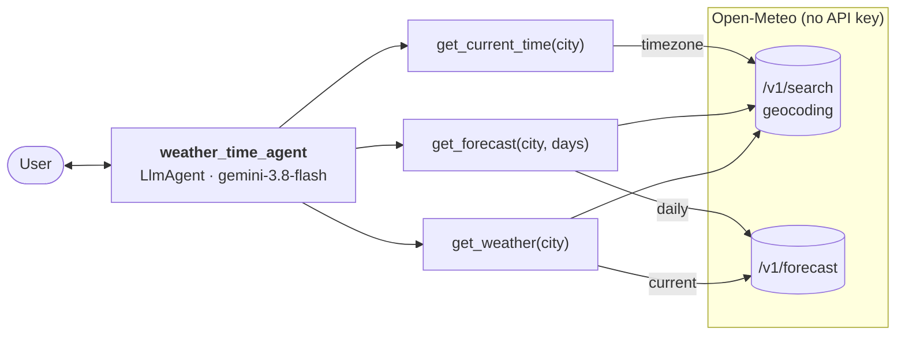

# ADK Quickstart

A minimal [Agent Development Kit (ADK)](https://adk.dev/) agent that reports the
live weather, a daily forecast (up to 16 days) and the current local time for
any city, running on Gemini.

## Agent Graph



## Project Structure

```
adk_quickstart/
├── weather_time_agent/
│   └── agent.py              # Open-Meteo tools, root agent and App
├── tests/
│   ├── unit/                 # Tool tests, no network or LLM calls
│   ├── integration/          # Runs the real agent against Gemini
│   └── eval/                 # Eval config, LLM-as-judge and datasets
├── AGENTS.md                 # Guide for coding agents
└── pyproject.toml
```

## Requirements

- **uv** — [install](https://docs.astral.sh/uv/getting-started/installation/)
- **agents-cli** (optional) — `uv tool install google-agents-cli`
- **Google Cloud SDK** — [install](https://cloud.google.com/sdk/docs/install), for Vertex AI

## Quick Start

```bash
cp .env.example .env          # set GOOGLE_CLOUD_PROJECT, or use GEMINI_API_KEY
gcloud auth application-default login
uv sync --all-extras
uv run adk web                # or: agents-cli playground
```

Open the web UI, pick `weather_time_agent` and ask something like
*"What's the weather in Paris, and what time is it there?"*

Both tools look the city up with the [Open-Meteo](https://open-meteo.com/)
geocoding API, and the weather comes from its forecast API. Open-Meteo needs no
API key and is free for non-commercial use (up to 10,000 calls a day).

## Configuration

| Variable | Default | Purpose |
|---|---|---|
| `GOOGLE_GENAI_USE_VERTEXAI` | `true` | Use Vertex AI (ADC) instead of AI Studio |
| `GOOGLE_CLOUD_PROJECT` | — | GCP project for Vertex AI |
| `GOOGLE_CLOUD_LOCATION` | `global` | Vertex AI location |
| `GEMINI_API_KEY` | — | AI Studio key, instead of the three above |
| `AGENT_MODEL` | `gemini-3.8-flash` | Model used by the agent |

## Commands

| Command | Description |
|---|---|
| `uv run adk web` | Local web UI (`uv run adk run weather_time_agent` for the terminal) |
| `uv run pytest tests/unit` | Tool tests, Open-Meteo stubbed, no credentials needed |
| `uv run pytest tests/integration` | End-to-end run against Gemini |
| `agents-cli eval run` | Run and grade `tests/eval/datasets/basic-dataset.json` |
| `agents-cli lint` | ruff, ty and codespell |

## Going further

`agents-cli scaffold enhance` adds a deployment target (Agent Runtime, Cloud
Run, GKE), a FastAPI server with A2A, Terraform and CI/CD.
